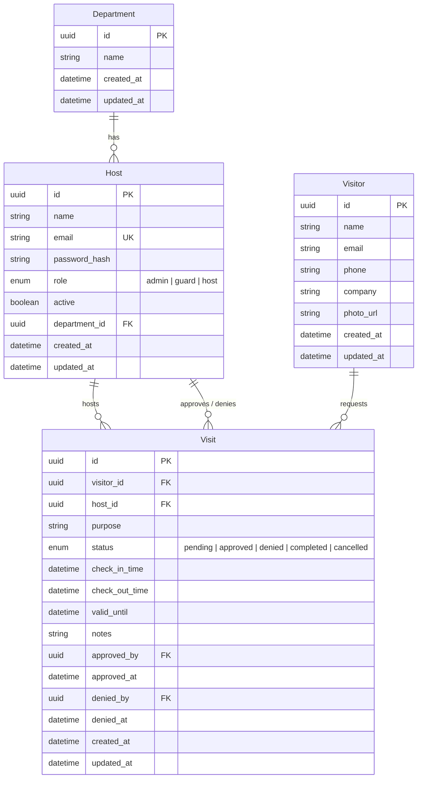

# 🏢 Campus Visitor Management System (Campus VMS)

A modern, secure, and full-stack **Visitor Management System** built with **React, TypeScript, Express, PostgreSQL (Neon), and Prisma ORM**. Streamlines visitor check-ins, automates host approvals, issues instant QR-code visitor passes via email, and provides real-time security dashboard analytics.

---

## 🚀 Key Features

* **📊 Live Security Dashboard:** Real-time metrics showing pending requests, expected visitors, active on-campus check-ins, and denied visits with auto-polling.
* **📝 Visitor Pre-Registration & Self Check-in:** Digital registration capturing visitor identity, host contact, purpose of visit, and optional photo upload.
* **🛡️ Multi-Role Access Control (RBAC):**
  * **Admin:** Full access to manage users, view campus-wide analytics, and delete/modify visit logs.
  * **Security Guard:** Approve/deny visits, manage gate check-ins and check-outs, and monitor expected visitor lists.
  * **Host (Staff/Faculty):** Review and approve/deny visitors requesting meetings with them.
* **📱 Automated QR Code Passes & Email Delivery:** Generates unique QR verification codes upon approval and emails digital visitor badges via EmailJS.
* **⏱️ Check-In & Check-Out Tracking:** Records exact timestamps when visitors enter and leave campus premises.
* **🖥️ Public Display View:** Dedicated kiosk display interface (`/dashboard`) showcasing today's approved visitors.
* **☁️ Cloud Ready & Serverless:** Fully deployable on Vercel as a unified frontend + backend serverless monolith.

---

## 🛠️ Tech Stack

### Frontend
* **Framework:** [React 18](https://react.dev/) + [Vite](https://vitejs.dev/)
* **Language:** [TypeScript](https://www.typescriptlang.org/)
* **Styling:** [Tailwind CSS](https://tailwindcss.com/)
* **State Management:** [Zustand](https://github.com/pmndrs/zustand)
* **Routing:** [React Router DOM v6](https://reactrouter.com/)
* **Animations:** [Framer Motion](https://www.framer.com/motion/)
* **Icons:** [Lucide React](https://lucide.dev/)
* **QR & Email:** `qrcode` + `@emailjs/browser`

### Backend
* **Runtime & Framework:** [Node.js](https://nodejs.org/) + [Express 5](https://expressjs.com/)
* **Language:** [TypeScript](https://www.typescriptlang.org/) + [tsx](https://github.com/privatenumber/tsx) / [esbuild](https://esbuild.github.io/)
* **Authentication:** JSON Web Tokens (`jsonwebtoken`) + Password Hashing (`bcryptjs`)
* **Validation:** [Zod](https://zod.dev/) Schema Validation
* **Media Upload:** [Multer](https://github.com/expressjs/multer) + [Cloudinary](https://cloudinary.com/)

### Database & ORM
* **Database:** [PostgreSQL (Neon Serverless)](https://neon.tech/)
* **ORM:** [Prisma ORM v7](https://www.prisma.io/) with `@prisma/adapter-neon`

---

## 🗄️ Database Architecture



---

## 📂 Project Structure

```text
Visitor-Management-System/
├── api/                    # Vercel Serverless Function entry point
│   └── index.js            # Bundled production backend for Vercel
├── prisma/
│   ├── schema.prisma       # Prisma models, enums & Neon datasource
│   ├── seed.ts             # Initial DB seed script (Admin & Departments)
│   └── check-admin.ts      # Admin verification utility script
├── server/                 # Express REST API
│   ├── index.ts            # Server entry point & route registration
│   ├── middleware/
│   │   ├── auth.ts         # JWT authentication, role guards & rate limiting
│   │   └── validation.ts   # Zod request payload validation schemas
│   ├── routes/
│   │   ├── auth.routes.ts      # /api/auth (login, session, logout)
│   │   ├── visits.routes.ts    # /api/visits (CRUD, filters, analytics stats)
│   │   ├── visitors.routes.ts  # /api/visitors (create, search, update)
│   │   ├── hosts.routes.ts     # /api/hosts (host directory & lookup)
│   │   └── upload.routes.ts    # /api/upload (Cloudinary photo upload)
│   ├── types/              # Server-side TypeScript interfaces
│   └── utils/
│       └── prisma.ts       # Singleton Prisma client with Neon serverless adapter
├── src/                    # React Frontend
│   ├── components/         # UI Views & Components
│   │   ├── Home.tsx                # Hero landing page with animated effects
│   │   ├── Login.tsx               # Sign-in page
│   │   ├── Layout.tsx              # Main dashboard shell & navigation
│   │   ├── Dashboard.tsx           # Stat cards & visitor status overview
│   │   ├── VisitorRegistration.tsx # Form to register a visitor & schedule visit
│   │   ├── VisitorApproval.tsx     # Review pending visits & trigger QR email
│   │   ├── VisitDetailsModal.tsx   # Detailed visit inspect/check-in/check-out modal
│   │   └── PublicDisplay.tsx       # Live kiosk screen for approved visitors
│   ├── lib/
│   │   └── api.ts          # Type-safe API client with automatic JWT handling
│   ├── store/
│   │   └── auth.ts         # Zustand global authentication store
│   ├── App.tsx             # Route declarations & PrivateRoute wrapper
│   └── main.tsx            # React root mount
├── vercel.json             # Vercel serverless routing & bundle configuration
├── package.json            # Scripts & project dependencies
└── vite.config.ts          # Vite build config
```

---

## ⚙️ Local Development Setup

### 1. Prerequisites
* [Node.js](https://nodejs.org/) (v18 or higher)
* [npm](https://www.npmjs.com/)
* A free [Neon PostgreSQL Database](https://neon.tech/)

---

### 2. Installation
Clone the repository and install dependencies:
```bash
git clone https://github.com/omPatil3690/Visitor-Management-System.git
cd Visitor-Management-System
npm install
```

---

### 3. Environment Configuration
Create a `.env` file in the root directory:
```env
# Server Configuration
PORT=3001
NODE_ENV=development
FRONTEND_URL=http://localhost:5173
JWT_SECRET=your-super-secret-jwt-key-here

# Database Connection (Neon PostgreSQL)
DATABASE_URL="postgresql://<user>:<password>@<host>/neondb?sslmode=require"

# (Optional) Cloudinary for Visitor Photos
CLOUDINARY_CLOUD_NAME=your_cloud_name
CLOUDINARY_API_KEY=your_api_key
CLOUDINARY_API_SECRET=your_api_secret

# (Optional) Frontend API URL (defaults to http://localhost:3001/api in dev)
VITE_API_URL=http://localhost:3001/api
```

---

### 4. Database Setup & Seeding
Generate the Prisma Client, push the schema to PostgreSQL, and seed the default data:

```bash
# 1. Generate Prisma Client
npm run prisma:generate

# 2. Push Schema to Neon Database
npm run prisma:push

# 3. Seed Default Departments and Admin User
npm run prisma:seed
```

---

### 5. Start the Application
Run both frontend and backend concurrently:
```bash
npm run dev:all
```

Or run them in separate terminals:
* **Backend API (`http://localhost:3001`):** `npm run server`
* **Frontend (`http://localhost:5173`):** `npm run dev`

---

## 🔑 Default Credentials

After running `npm run prisma:seed`, log in with:

| Role | Email | Password |
| :--- | :--- | :--- |
| **System Administrator** | `admin@vms.com` | `admin123` |

---

## 📡 REST API Reference

### Authentication (`/api/auth`)
| Method | Endpoint | Description | Auth Required |
| :--- | :--- | :--- | :--- |
| `POST` | `/api/auth/login` | Authenticate host/admin & get JWT token | No |
| `GET` | `/api/auth/session` | Fetch currently authenticated user session | Yes |
| `POST` | `/api/auth/logout` | Clear session cookie & logout | Yes |

### Visits (`/api/visits`)
| Method | Endpoint | Description | Auth Required |
| :--- | :--- | :--- | :--- |
| `GET` | `/api/visits` | List visits (supports `status`, `startDate`, `endDate`, `hostId`) | Yes |
| `GET` | `/api/visits/stats` | Aggregate visit metrics for dashboard | Yes |
| `GET` | `/api/visits/:id` | Get details of a single visit | Yes |
| `POST` | `/api/visits` | Create a new visit request | Yes |
| `PUT` | `/api/visits/:id` | Update visit status (`approved`, `denied`, `completed`) & timestamps | Yes |
| `DELETE` | `/api/visits/:id` | Delete visit record (Admin only) | Admin |

### Visitors (`/api/visitors`)
| Method | Endpoint | Description | Auth Required |
| :--- | :--- | :--- | :--- |
| `GET` | `/api/visitors/search` | Search visitor by email or phone | Yes |
| `GET` | `/api/visitors` | List all registered visitors | Yes |
| `GET` | `/api/visitors/:id` | Get visitor details & historical visits | Yes |
| `POST` | `/api/visitors` | Create or update visitor record | Yes |
| `PUT` | `/api/visitors/:id` | Update visitor profile details | Yes |

### Hosts (`/api/hosts`)
| Method | Endpoint | Description | Auth Required |
| :--- | :--- | :--- | :--- |
| `GET` | `/api/hosts/search` | Look up host details by email | Yes |
| `GET` | `/api/hosts` | List all registered staff hosts | Admin / Guard |
| `GET` | `/api/hosts/:id` | Get specific host profile | Yes |

### Media Upload (`/api/upload`)
| Method | Endpoint | Description | Auth Required |
| :--- | :--- | :--- | :--- |
| `POST` | `/api/upload` | Upload visitor photo to Cloudinary | Yes |

---

## 🌐 Deploying to Vercel

This repository is pre-configured to deploy both the **React Frontend** and **Express Backend** together on [Vercel](https://vercel.com).

### 1. Import to Vercel
1. Push your repository to GitHub.
2. Go to [vercel.com](https://vercel.com) and click **"Add New..." ➔ "Project"**.
3. Import your `Visitor-Management-System` repository.

### 2. Configure Environment Variables in Vercel
Add the following variables in **Project Settings ➔ Environment Variables**:

| Variable | Value |
| :--- | :--- |
| `DATABASE_URL` | Your Neon PostgreSQL connection string |
| `JWT_SECRET` | A secure random secret string |
| `NODE_ENV` | `production` |
| `CLOUDINARY_CLOUD_NAME` | *(Optional)* Your Cloudinary cloud name |
| `CLOUDINARY_API_KEY` | *(Optional)* Your Cloudinary API key |
| `CLOUDINARY_API_SECRET` | *(Optional)* Your Cloudinary API secret |

*(Make sure to enable all environments: **Production**, **Preview**, and **Development**)*

### 3. Deploy
Click **Deploy**. Vercel will automatically build the React assets and package the Express serverless function!

---

## 📄 License

This project is licensed under the **MIT License**.
